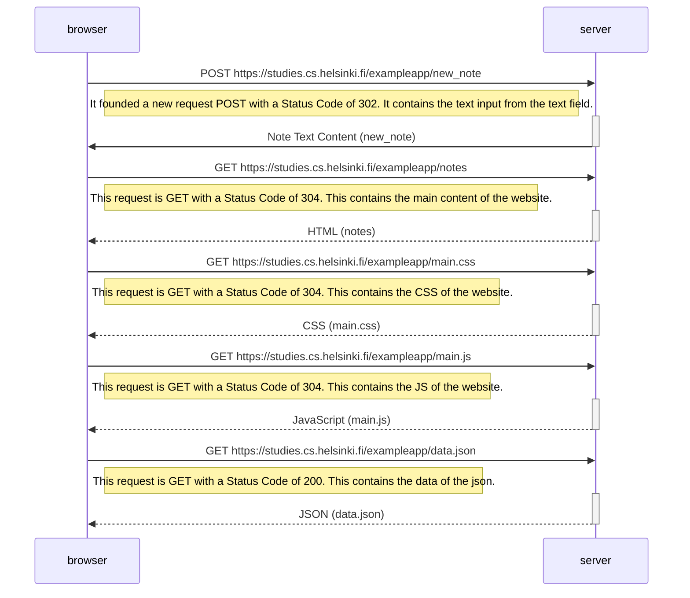

```mermaid
%% 0.4: New note diagram | my first mermaid diagram 1-12-2023 :)
sequenceDiagram
    participant browser
    participant server

    browser->>server: POST https://studies.cs.helsinki.fi/exampleapp/new_note 
    Note right of browser: It founded a new request POST with a Status Code of 302. It contains the text input from the text field.
    activate server
    server->>browser: Note Text Content (new_note)
    deactivate server
    
    browser->>server: GET https://studies.cs.helsinki.fi/exampleapp/notes
    Note right of browser: This request is GET with a Status Code of 304. This contains the main content of the website.
    activate server
    server-->>browser: HTML (notes)
    deactivate server

    browser->>server: GET https://studies.cs.helsinki.fi/exampleapp/main.css
    Note right of browser: This request is GET with a Status Code of 304. This contains the CSS of the website.
    activate server
    server-->>browser: CSS (main.css)
    deactivate server

    browser->>server: GET https://studies.cs.helsinki.fi/exampleapp/main.js
    Note right of browser: This request is GET with a Status Code of 304. This contains the JS of the website.
    activate server
    server-->>browser: JavaScript (main.js)
    deactivate server

    browser->>server: GET https://studies.cs.helsinki.fi/exampleapp/data.json
    Note right of browser: This request is GET with a Status Code of 200. This contains the data of the json.
    activate server
    server-->>browser: JSON (data.json)
    deactivate server
```
