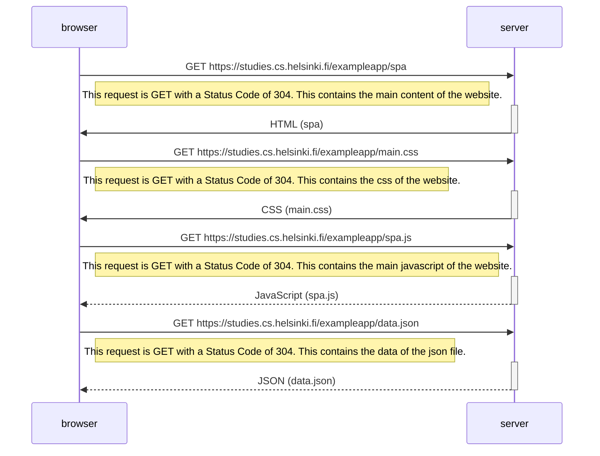

```mermaid
%% 0.5: Single page app diagram | my second mermaid diagram 1-12-2023 :)
sequenceDiagram
    participant browser
    participant server

    browser->>server: GET https://studies.cs.helsinki.fi/exampleapp/spa
    Note right of browser: This request is GET with a Status Code of 304. This contains the main content of the website.
    activate server
    server->>browser: HTML (spa)
    deactivate server
    
    browser->>server: GET https://studies.cs.helsinki.fi/exampleapp/main.css
    Note right of browser: This request is GET with a Status Code of 304. This contains the css of the website.
    activate server
    server->>browser: CSS (main.css)
    deactivate server

    browser->>server: GET https://studies.cs.helsinki.fi/exampleapp/spa.js
    Note right of browser: This request is GET with a Status Code of 304. This contains the main javascript of the website.
    activate server
    server-->>browser: JavaScript (spa.js)
    deactivate server

    browser->>server: GET https://studies.cs.helsinki.fi/exampleapp/data.json
    Note right of browser: This request is GET with a Status Code of 304. This contains the data of the json file.
    activate server
    server-->>browser: JSON (data.json)
    deactivate server
```